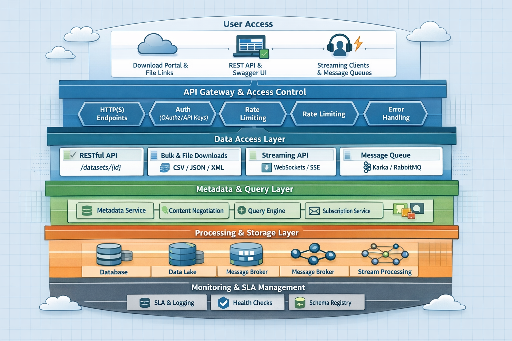

# Mechanisms

Here’s a concrete proposal for “mechanisms” aligned with the Y.MIM Minimal Interoperability Model (MIM). I’ve translated each capability into implementable, technology-agnostic mechanisms you can actually use in an architecture or implementation plan.

&#x20;**Examples:**

| **Capability**                                               | **REST API's**             | **Bulk File Download**          | **Publish-Subscribe Mechanism** | **SPARQL Endpoint**       | **JSON-RPC** |
| ------------------------------------------------------------ | -------------------------- | ------------------------------- | ------------------------------- | ------------------------- | ------------ |
| **C.1** Machine-readable data is retrievable through the web | ✔ REST endpoints           | ✔ CSV / JSON / XML downloads    | ✔ Streams (Kafka, WebSockets)   | ✔ RDF via SPARQL endpoint |              |
| **C.2** Structured & queryable access is possible            | ✔ Query params, filtering  | ✖ Limited (full dataset only)   | ✖ Not primary (event-based)     | ✔ Rich semantic querying  |              |
| **C.3** Subscription to changes is possible                  | ⚠ Polling (basic fallback) | ✖ Not supported (use ATOM feed) | ✔ Native (Kafka, RabbitMQ, SSE) | ⚠ Limited websub?         |              |

## How to read this (practically)

You can interpret this as a layered delivery model:

*   Level 1 (Minimum MIM compliance)

    → REST API + JSON + OpenAPI + basic metadata
*   Level 2 (Operational maturity)

    → Pagination, caching, downloads, SLA, versioning
*   Level 3 (Advanced interoperability)

    → Streaming, eventing, subscriptions, semantic metadata

<figure><figcaption></figcaption></figure>

Visual architecture (layer diagram)

Examples

### C.1 Machine-readable data is retrievable through the web

Core mechanisms (MUST):

* HTTP-based data access
  * RESTful APIs over HTTPS
  * Direct file endpoints (e.g. /downloads/{dataset})
* Standard data formats
  * JSON (default)
  * CSV or XML (as alternative) 

Supporting mechanisms (SHOULD):

* Bulk data delivery
  * Periodic full dataset exports (e.g. nightly snapshots)
  * Incremental/delta exports (change logs)
* Subscription mechanisms
  * Webhooks (HTTP callbacks)
  * Event-based subscriptions (via message broker)
* Streaming delivery
  * WebSockets or Server-Sent Events (SSE)
* Time-based querying
  * Query parameters: ?startDate=...\&endDate=...
* Message queue access (optional)
  * Kafka / AMQP topics per dataset

***

### C.2 API Interface and Behavior

Core mechanisms (MUST):

* Machine-readable API specification
  * OpenAPI (OAS 3.x)
* Content negotiation
  * HTTP Accept headers (application/json, text/csv)
* Standard metadata in responses
  * Headers:
    * Last-Modified
    * Content-Type
    * X-Total-Count
    * RateLimit-\*
* RESTful design conventions
  * Resource-based endpoints: /datasets/{id}/records
* Pagination
  * Limit/offset or cursor-based pagination
* Error handling
  * HTTP status codes (200, 400, 404, 500)
  * Structured error body (JSON)
  *

Supporting mechanisms (SHOULD):

* Versioning
  * URI versioning (/v1/) or header-based
* Caching
  * ETag, Cache-Control, If-Modified-Since
* Geospatial querying
  * Bounding box (bbox) or GeoJSON filters
* Change subscription
  * Webhooks or event streams
* Health endpoint
  * /health or /status
* Partial responses
  * Field selection: ?fields=id,name,date
* Example payloads
  * Embedded in OpenAPI or developer portal

***

### C.3 Direct File Download Capability

Core mechanisms (MUST):

* Stable download endpoints
  * Predictable URLs:
    * /downloads/{dataset}/latest
    * /downloads/{dataset}/{version}
* Structured file formats
  * CSV, JSON, or XML

Supporting mechanisms (SHOULD):

* Metadata inclusion
  * Embedded headers OR companion file (.json metadata)
* Full + incremental exports
  * Full snapshot files
  * Delta files (e.g. changes\_YYYYMMDD.json)
* Versioning
  * Timestamped or semantic versions

***

### C.4 Publish & Subscribe Mechanisms

#### C.4.1 Message Queue Integration

Core mechanisms (MUST):

* Standard messaging platform
  * Apache Kafka
  * AMQP (e.g. RabbitMQ)
  * MQTT (lightweight IoT use cases)
* Structured messages
  * JSON schema (or Avro/JSON-LD aligned with MIM1)
* Delivery guarantees
  * At-least-once delivery
* Acknowledgement handling
  * Consumer offset commits / ACK messages
* Durability
  * Persistent topics/queues with retention policies

Supporting mechanisms (SHOULD):

* Topic design
  * Per dataset or domain (city.traffic.flow)
* Schema registry
  * Central schema validation (e.g. Confluent Schema Registry)

***

#### C.4.2 Real-Time Data Streaming

Core mechanisms (MUST):

* Streaming protocols
  * WebSockets
  * Server-Sent Events (SSE)
* Structured payloads
  * JSON messages
* Event metadata
  * Timestamp
  * Sequence ID
* Connection management
  * Heartbeat / keep-alive
  * Reconnection support

Supporting mechanisms (SHOULD):

* Replay capability
  * Resume from last event ID
* Backpressure handling
  * Rate throttling or buffering

***

### C.5 Metadata

Core mechanisms (MUST):

* Machine-readable metadata
  * JSON-LD (preferred)
  * DCAT-AP compliant metadata
* Consistent metadata structure
  * Dataset description
  * Publisher
  * Temporal coverage
  * Update frequency
  * License

Supporting mechanisms (SHOULD):

* Metadata endpoint
  * /datasets/{id}/metadata
* Central catalog
  * CKAN, data portal, or metadata registry

***

### C.6 Reliability and Quality when Accessing Data

Core mechanisms (MUST):

* Service Level Agreement (SLA) exposure
  * Availability (% uptime)
  * Response time expectations
* Monitoring and observability
  * API metrics (latency, error rate)
  * Logging and tracing
* Error transparency
  * Standardized error responses

Supporting mechanisms (SHOULD):

* Status page
  * Public service health dashboard
* Rate limiting
  * Throttling policies per consumer
* Fallback mechanisms
  * Cached responses or degraded modes

***

## Overarching Cross-Cutting Mechanisms

These strengthen all capabilities:

* Security & access control
  * OAuth 2.0 / API keys
* Data versioning
  * Dataset version identifiers
* Interoperability standards
  * JSON-LD, DCAT-AP
* Developer enablement
  * Developer portal with documentation, examples, and sandbox

***

